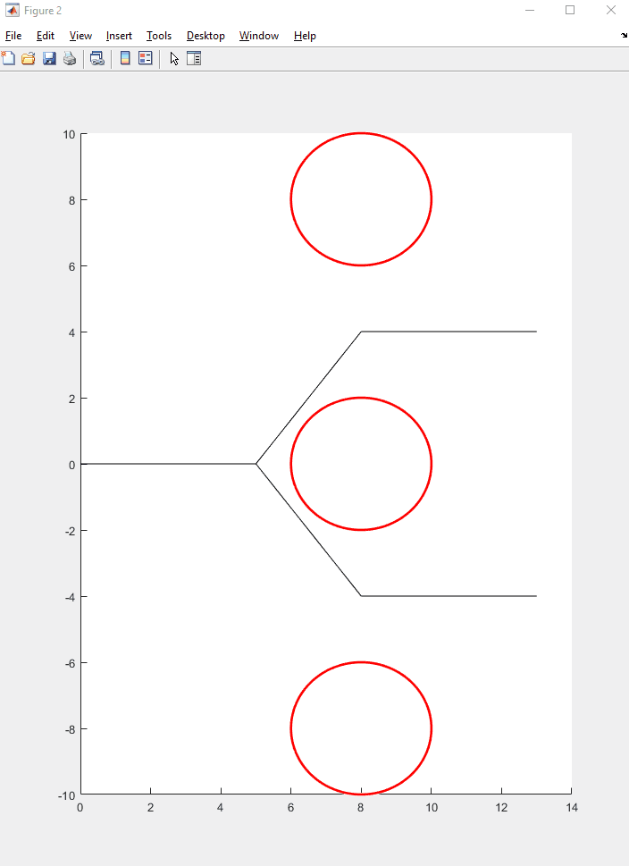
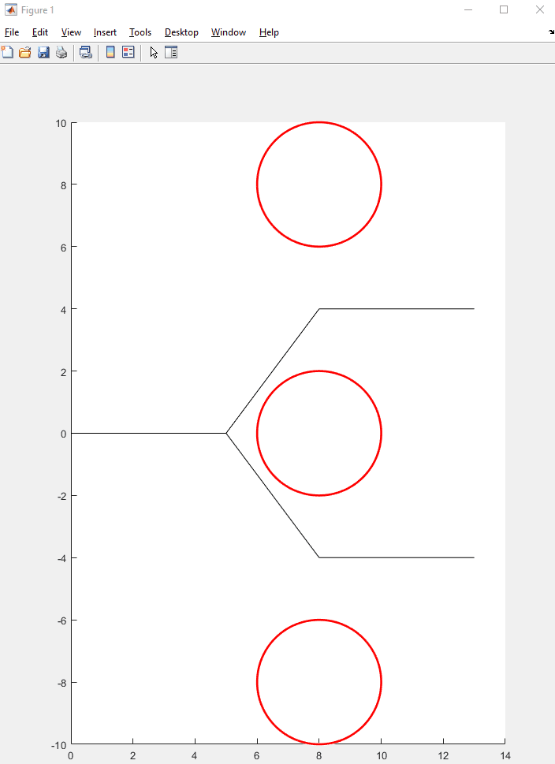

# RRT Connect for a 3 Joint Arm in 2D Workspace
A project in CSDS499, Algorithmic Robotics, this is an implementation of the RRT-Connect algorithm for a 3 revolute joint arm in a 2D workspace with circular obstacles. 
The algorithm generates random states and uses nearest neigbor Kd-Tree search in the configuration space to find collision free paths between a start configuration
and a goal configuration.

## Gif outputs
Below are a few example paths generated by the algorithm.

